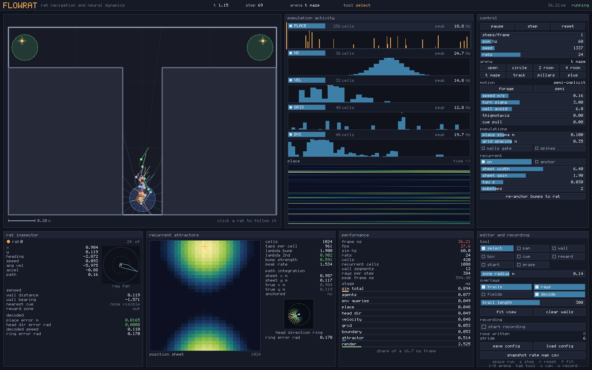

# FlowRat

A real-time simulator for rat navigation and hippocampal neural dynamics,
written in [Flow](https://github.com/flooooooooooow/flow).



One window shows the whole model at once: where the rats are, what they
sense, what every neural population is doing, what the recurrent networks are
holding, and where the frame time went. The arena is editable while the
simulation runs, and every panel updates from the edit on the next step.

```bash
./run.sh          # open the window
./validate.sh     # functional checks, no window needed
./bench.sh        # benchmarks
```

Needs a Flow checkout. Set `FLOW_HOME` if yours is not at `~/flow`.

---

## What it does

**Rats.** A batch of agents in a two-dimensional arena, from one to four
thousand. Speed and turn rate each follow an Ornstein-Uhlenbeck process, so
motion is correlated and smooth rather than white noise on the heading. On
top of that: wall avoidance from a cast ray fan, optional edge-following, and
optional attraction to visible landmarks. Four integrators, including the
closed-form arc the other three are measured against.

**Arenas.** Rectangular, circular, two-room, four-room, T maze, plus maze,
linear track and a pillar field, all built from the same editing API the
mouse drives. Walls, solid blocks, landmarks, food patches and a nest can be
added and removed while the simulation runs.

**Behaviour in bouts.** A rat is in exactly one of nine states at a time:
exploring, foraging, eating, drinking, grooming, rearing, resting, heading
home or scanning. Each has an entry condition and a duration, so behaviour comes in bouts
the way a real animal's does. Maintenance behaviours are rolled for at rates
scaled by how hungry the animal is, which is what lets a peckish rat still
groom while a starving one does not.

The **analysis** tab is the measurement layer: a rate map binned from the run,
its autocorrelogram, the scores, a head-direction tuning curve and a matrix of
which behaviour follows which. Press record and it samples while the
simulation runs. It also writes every number to a CSV.

The **ethogram** tab is the time budget: what fraction of its time the colony
spends on each activity, how many bouts of each, how long they last, and what
everyone is doing at this instant. A fed rat in a familiar arena comes out
near half its time in locomotion with rearing, grooming and resting taking
most of the rest, which is the range the open-field literature reports. It is
the first number in FlowRat that can be held against a published measurement.

**A head that moves.** The head has its own angle relative to the body, its
own dynamics and a range of about a hundred degrees either side. That matters
twice over: head-direction cells encode the head, which is what gives them
their name, and the sensory ray fan is cast from the head because that is
where the whiskers and the eyes are. Steering still works off the body, so
wall avoidance takes the head's offset back out.

**Looking before choosing.** At a fork, a rat stops and sweeps its head
between the options before committing. A fork is somewhere with three or more
open directions, read straight off the cached ray fan, so it needs no map. In
a plus maze this happens dozens of times a minute and takes about six per cent
of the time budget; in an open field it never happens, because there is
nothing to choose between. It is one of the most studied behaviours in the
hippocampal literature and it needs a head that moves independently of the
body to exist at all.

**Food, hunger and eating.** Food is individual pellets, each an object with
a position of its own. Hunger rises on its own, and a hungry rat goes and
finds something: it steers toward the nearest patch it can see, stops when it
gets there, and takes a mouthful. One mouthful is one pellet, and that pellet
is gone from that spot. A patch is shared, so rats compete, and when the last
pellet goes it stays gone unless the patch was given a regrowth rate.
Optional hoarding makes a rat carry food back to the nest before eating it,
and its load is drawn on its back one pellet at a time.

Discrete items are a deliberate replacement for an amount. A patch used to
hold a number, drawn as a scatter of decorative pellets regenerated from a
seed: eating removed a tenth of a unit and the picture did not change, so you
could watch a rat feed for ten seconds and see the same pellets in the same
places throughout. Nothing a rat did to the world was legible. Now every
interaction is a thing you can point at.

Crowding follows from that. More rats round a pile no longer means a smaller
mouthful each, it means a longer wait for the same one, which is what
jostling for a spot actually costs.

Food is conserved: every unit removed from a patch ends up inside a rat, and
the validation suite checks that to six decimal places. Feeding runs as a
serial pass after the parallel motion step, so several rats sharing one patch
never race on its amount and competition stays reproducible to the bit.

**Measuring the run rather than the model.** Every other panel in FlowRat
draws the model's own state, and the rate map it used to export was the
analytic tuning the model was handed: a Gaussian, drawn as a Gaussian, which
proves that the code can evaluate the formula it was given.

`src/analysis/` measures instead. Bin the arena, count how long the rat spent
in each bin and how many spikes it fired there, divide, and score what comes
out: Skaggs information in bits per spike, sparsity, fields found by flood
fill, gridness from the spatial autocorrelogram, head-direction tuning with a
Rayleigh test, and a transition matrix over the behavioural states. Spikes
rather than rates, because binning a rate gives back a smoothed copy of the
rate and the model would be checking its own formula against itself.

The point is that the analysis and the model are independent code paths, so
agreement between them means something. Over a thousand-second run:

| measured | model |
|---|---|
| place field centre 0.032 m from | the configured centre |
| place field 0.0234 m² | a sigma of 0.086 predicts 0.0430 |
| head cell prefers 0.013 rad | configured 0.000 |
| lattice spacing 0.312 m | configured 0.350 |

with the negative controls alongside: a velocity cell scores 1.35 bits per
spike against a place cell's 6.15, a place cell's autocorrelogram scores
-0.000 for gridness against a grid cell's 0.165, and a place cell is not
directional on the same test that finds a head-direction cell highly so.

A bin the animal never visited has no rate, and is drawn as a hole and left
out of every sum. Filling those in as silence is the easiest way to make a
field look cleaner and an information score higher than the run supports. The
panel says so too: below half coverage it prints that too little of the arena
has been seen for the scores to mean much yet.

Everything in it also writes to one CSV: the scores, every bin of the map
visited or not, every heading bin and every behavioural transition.

**Symbols rather than regions.** A food patch used to be drawn as a
translucent green disc, and the disc meant nothing a reader could name: not a
wall, not a thing, just an area that was somehow foodish. The items are now
drawn where they are, as amber seeds and blue drops, and the patch is reduced
to what it still genuinely is, which is the place regrowth happens and the
place a rat remembers. When it holds something the items say where it is;
when it is bare a faint ring marks it, because "there was food here and it has
gone" is worth seeing. The nest keeps an outline, because being inside it is
what home means to the reckoning, and it gets a roof so it is nameable.

**A room that becomes familiar.** Each rat carries a coarse map of where it
has been: 16 by 16 over the arena, one byte a cell. Standing somewhere makes
it familiar and familiarity fades. Three things read it. Wall hugging is a
constant plus however new the ground underfoot is, so a naive rat works along
the skirting board and stops as the room becomes ordinary. An exploring rat
drifts toward whichever corner it knows least. And a landmark loses its pull
as the part of the room it stands in becomes familiar.

In an empty arena a naive colony spends 46.1 per cent of its first minute
within a body length or two of a wall and 27.2 per cent of its sixth. With the
map switched off the same measurement starts at 24.8 and falls to 13.6, so
some of the drop is the motion model settling rather than the animal learning.
The map's contribution is that a naive rat starts far more wall-bound and
comes down 19 points rather than 11. Heading for what it knows least gets a
rat over twice as much of the arena in five minutes.

Thigmotaxis applies only to a rat that is exploring, and is scaled down by
whichever drive is stronger. It is exploratory caution: a hungry rat crosses
the open middle to get to food. Leaving it on during foraging diverted every
trip and cost the colony a third of its leisure.

The habituation of a landmark is by proxy. The rat habituates to the place the
cue stands in rather than to the cue itself, so a landmark seen a hundred
times from across the room stays interesting until the rat walks over there.
That is a simplification and it is the only one in this part of the model.

**Rats notice each other.** Until now four thousand rats were four thousand
independent simulations that walked through each other. A uniform grid over
the arena answers "who is near me" in constant time: bin every rat by the cell
it stands in, then look only in that cell and its eight neighbours. The build
is a counting sort, three integer arrays, no allocation per step. Over eight
arenas and 2048 queries it agrees with a brute-force sweep exactly.

On top of it: personal space, which is a gentle turn away from whoever is
inside a body length; optional following, which turns toward the mean heading
of the neighbours and is off by default; and crowding, which slows a rat's
eating in proportion to how many others have their heads in the same pile.

The grid keeps its own copy of the positions it binned. It has to. The grid
holds indices, and the obvious way to answer "how far is rat j" is to read its
position, which is exactly what the parallel motion pass is busy writing. Two
runs of one seed diverged by most of a metre over four hundred steps. Freezing
the positions at build time costs four doubles per rat and buys the guarantee
back, and it is the more defensible model anyway: every rat now reacts to the
same instant of the colony rather than to a mixture of before and after.

One old guarantee had to be split rather than kept. A rat's path used to be
independent of how many rats were simulated alongside it. That still holds
with the social term off, and must not hold with it on, because steering
around your neighbours is the whole point. The suite checks both directions.

**Thirst, and two drives that compete.** Water sits in every arena as a
puddle: finite, drinkable, refilling at its own rate, the same machinery as a
food patch and told which kind it is working on. Thirst rises on its own the
way hunger does. Every arena puts the water away from the food, because a rat
that could eat and drink in one place would never have to choose.

The state machine serves one drive at a time, and only the chosen drive's
patches are visible to the rest of it: a thirsty rat walks past food. Which
one wins is whichever is more pressing, but only by a margin. At the crossover
the two levels sit within a hair of each other, and a rat that simply took the
larger changed its mind constantly, walking a few centimetres toward the water
and then a few back toward the food. Over four hundred seconds the margin cuts
the number of changes from 215 to 160.

Adding the second drive meant rescaling the first. A rat crosses the arena in
about twenty seconds, and at the old metabolism it went from fed to starving
in less than one traverse. That passed the time budget while hunger was the
only drive, because a rat could camp on a patch and eat as fast as it emptied.
With the water in another corner camping stopped working, and the colony spent
93 per cent of the run walking with no leisure at all: 1.8 per cent on
grooming, rearing and resting put together. Both rates are now set against the
traverse, so a drive takes about four crossings to become urgent, and the
budget is back in its band.

**Memory of food.** A rat keeps a short list of places it has seen food, six
slots deep, each with a confidence that decays. Seeing a patch writes or
refreshes a note; walking to a remembered patch and finding nothing empty
clears it. When a hungry rat can see no food at all it goes to the best note
it holds, weighing confidence against distance.

This is what makes an arena with a wall across it a task rather than a
lottery. In a two-room arena with the food behind the divider and the rats
hoarding, so that every meal costs a round trip from a nest that cannot see
the larder, the colony carries off 83 units in two hundred seconds without
memory and 333 with it. Turning the memory off in the control panel is the
control condition for the whole feature.

**Finding the way home.** Home is not stored as a place. Each rat carries a
vector to the nest and keeps it current by subtracting its own movement, so it
points home from wherever the animal is without landmarks, sight or a map.
That is dead reckoning, and the error it accumulates is the point: the noise
added each step scales with the square root of the distance moved, so the
drift grows as a random walk over the path rather than linearly. Getting home
corrects it, because arriving is a fix.

Two distances matter and they are different. The rat can smell its nest from a
little way outside it, and inside it it has arrived. Beyond smelling range it
steers by the reckoning; within it, it walks at the nest itself. Making those
one number does not work: near the nest the reckoned vector is as short as its
own error, so the bearing is noise and the rat circles the spot it believes is
home. With a single radius the colony logged twenty-seven trips home in five
minutes and almost no arrivals.

A rat that wants to rest and has a nest walks back to it first, and a nest
bout is a long sleep rather than the short pause it takes standing where it
is. That is the only way heading home is reachable with hoarding switched off.

**Two ways of doing the same sum.** The recurrent sheet and the home vector
are both integrating self-motion into an estimate of where the rat is. One is
a few thousand units that runs for the selected rat alone; the other is two
doubles per rat that the whole batch can afford. The attractors panel scores
both against the same ground truth and says which is closer, which is a
comparison neither number makes on its own.

**Populations.** Place cells, head-direction cells, velocity cells, grid
cells and boundary vector cells. Each has its own module, its own parameters,
its own visualisation and its own line in the profiler. Rates optionally
become Poisson spikes.

**A circuit.** Switch on input-driven place cells and a
place cell loses all access to position. It fires only from a weighted set of
boundary and grid inputs, and its field is whatever those add up to. Move a
wall and the field moves with it, because it was never anchored to a
coordinate. The connectome tab shows the wiring the update actually reads:
which cells feed the selected one, what each is contributing right now, what
arrangement of walls it is tuned to, and the arithmetic that turns that into
a rate.

**Recurrent dynamics.** Two continuous attractor networks integrating
`tau dr/dt = -r + phi(Wr + I)`. A ring holds head direction; a sheet holds
position and path-integrates velocity. Connectivity is a local kernel plus a
global inhibitory term rather than a weight matrix, and the network's
stability is set by computing the operator's spectrum rather than by tuning.

**Recording.** Trajectories, per-cell rates and spikes, recurrent state
summaries, rate maps and occupancy maps, all as CSV. Configurations save and
load, arena included.

---

## In a browser

FlowRat compiles to WebAssembly and runs on a canvas with the whole interface
intact: same arena, same panels, same tabs.

```bash
./tools/wasm.sh          # builds, then serves on localhost:8731
```

Then open the page and press Start. The script passes `--link` for
`flow_rt_support.c`, which is not optional: the monotonic clock the profiler
uses lives there, the browser build does not pull it in on its own, and
without it emcc fails on that one undefined symbol.

Measured in Chrome at 1440 by 900 with the default 24 rats: about 14 ms a
frame against 4.6 ms native. The batch is single-threaded there, since
`parallel for` needs SharedArrayBuffer and the cross-origin isolation headers
that go with it, so the browser build is the serial fallback rather than a
slower version of the same thing.

## Running it

```bash
./run.sh                                   # live window
./tools/record.sh flowrat.flow 300         # 300 frames to data/out/frames
./tools/uidemo.sh                          # a scripted session, recorded
./tools/gif.sh docs/flowrat.gif            # the same session as a GIF
./tools/mkconfig.sh                        # rebuild data/configs
```

`run.sh` needs a display. Everything else runs headless.

## Reproducible experiments

For browser UI regression checks, start the local WASM page and run
`./tools/ui-smoke.sh`. It exercises launch, pause, resume, step, reset,
fullscreen/layout invariants, scrolling-related controls, and all nine arena
presets.

The TOML experiment layer cues an entire protocol: seed, arena, timing,
movement, behaviour, neural populations, recording, and analysis targets live
in one file. Included protocols cover open-field exploration, T-maze choice,
obstacle navigation, homing, and cue remapping.

```bash
python3 tools/flowrat_experiment.py validate experiments/open-field.flowrat.toml
python3 tools/flowrat_experiment.py generate experiments/presets/homing.flowrat.toml \
  --output data/out/experiments/homing.synthetic.csv
python3 tools/flowrat_experiment.py analyze data/out/experiments/homing.synthetic.csv \
  --output data/out/experiments/homing.metrics.json
```

Tracked movement can be imported from a video-tracking export with
`time,x,y,rat` or common `frame,x_px,y_px,animal_id` columns, then compared to
the synthetic protocol. See [`experiments/README.md`](experiments/README.md)
for the schema and real-data workflow.

### Keys

| key | does |
|---|---|
| `space` | run or pause |
| `s` | one step |
| `r` | reset |
| `1` to `8` | arena preset |
| `tab` | next tool |
| `f` | fit the view to the arena |
| `t` `y` `u` `i` | trails, rays, place fields, decode overlay |
| `k` | what the selected rat knows of the room |
| `c` | recurrent networks on or off |
| `p` | anchor the attractors to the true state |
| `n` | place cells driven by inputs, on or off |
| `o` | start or stop recording |
| `-` `=` | interface scale, 1 to 3 |
| `esc` | quit |

The window is resizable and has a full-screen button. The layout follows it:
panels are fractions of the window, and the framebuffer is rebuilt to match
so the result is drawn at the window's own resolution rather than stretched.
Below a minimum size the layout stops shrinking and the frame is scaled down
instead. `-` and `=` trade content for size: at scale 2 the cockpit is laid
out smaller and stretched, so everything is twice as large on screen.

### Mouse

Pick a tool in the editor tab, then work in the arena view. **select**
follows a rat, **wall** drags a barrier, **box** drags a solid block,
**cue** drops a landmark, **reward** drops a food patch stocked with whatever
the editor's food sliders say, **start** places the nest, and **erase**
removes whatever is under the cursor.

Three gestures work whatever tool is selected:

- **the wheel** zooms about the cursor, in proportion to how far it turned
- **the right button** drags the view, so panning never means changing tool
- **a double click** restores a default: on empty floor it refits the arena,
  and on any slider it returns that parameter to the value the model was
  built with. Every slider draws a small notch where its default sits.

---

## What the panels tell you

**Environment view.** The arena, obstacles, landmarks, zones, every rat with
a heading tick whose length is its speed, and trajectory trails that fade
with age. The selected rat gets a full trail and, with the overlay on, its
ray fan drawn out to the walls it is reading. The teal cross is where the
place-cell population thinks the rat is; the line back to the rat is the
decode error.

**Population activity.** All five populations as bar charts of the selected
rat's current rates, drawn against each population's configured peak so a
quiet population looks quiet. Below them, a raster of one population over
time: cells down, time across.

The bottom row is tabbed, so one panel at a time gets the full width.

**Ethogram.** The time budget as a stacked bar and a table, bout-length
histograms on a log axis, and the live division of the batch across states.

**Rat inspector.** Position, heading, speed, angular velocity, acceleration
and path length; what the rat senses; what the populations decode back out,
next to the truth; and what the rat wants, which is its hunger, what it has
eaten, what it is carrying and whether it is exploring, heading for food or
eating. Beside that, the colony: how much food is left in the arena, how much
has been eaten, the mean hunger and how many are starving.

**Attractors.** The position sheet as a heat map with a crosshair on the
decoded bump, the head-direction ring as a dial with two needles for truth
and estimate, the drift of the path integrator against ground truth, and the
eigenvalues that set the network's regime. `lambda 2nd` above one means the
sheet has left the single-bump regime and broken into a lattice. The
parameters of both networks sit beside their readouts.

**Connectome.** Only meaningful with input-driven place cells on. For the
selected cell: its inputs as a graph with edges lit by what each is
contributing this instant, a polar plot of the wall arrangement it is tuned
to, and the summed drive against the threshold it has to clear. This is the
panel that answers why a particular cell is firing.

**Performance.** Frame time, rats, cells, and a bar per stage scaled against
a 16.7 ms budget.

**Editor and recording.** Tools, overlays, view fitting, recording and
configuration.

**Control**, on the right, is always visible.

---

## Where the controls live

The control panel on the right holds what governs the run: the arena, the
batch, the clock, the drives and the motion. A parameter that shapes one
feature lives in the tab that draws that feature, where there is room for it
and where its effect is visible while the slider is under the cursor. The
populations and the circuit are in the connectome tab; memory, novelty and the
social terms are in the ethogram tab; recording is in the analysis tab; the
recurrent networks are in the attractors
tab.

That split started as a fix. The panel is a fixed column and it filled up: at
1440 by 900 its last four rows, the circuit toggle among them, ran past the
bottom edge and could not be clicked at all, while the connectome tab told the
reader to turn on input-driven place cells in the control panel.

## Layout

```
flowrat.flow          the application
validate.flow         functional checks
bench.flow            benchmarks
mkconfig.flow         writes the demo configurations
run.sh validate.sh bench.sh

src/core/             rng, clock, profiler
src/env/              geometry, environment, queries, presets
src/sim/              agents, integrators, motion, behaviour, memory,
                      the spatial grid, novelty, the simulation
src/neural/           the population framework and five populations,
                      plus the continuous attractor network
src/analysis/         rate maps, scores and recording sessions
src/ui/               framebuffer drawing, widgets, layout, panels
src/io/               recording and configuration

tools/                env.sh and the recording, checking and demo scripts
data/configs/         demo configurations
data/out/             recordings and exports (not tracked)
docs/                 architecture, validation, extending
```

Entry points sit at the repository root because Flow resolves imports
relative to the importing file and rejects `..`. See
[docs/architecture.md](docs/architecture.md).

---

## Current state

Everything described above is implemented and runs, and the validation suite
passes. It covers geometry, all eight arenas, the integrators against their
closed form, containment under motion, determinism, every population's
tuning, the recurrent networks against a dense reference, recording,
configuration round trips, food memory and dead reckoning, thirst against
hunger, the spatial grid against a brute-force sweep, thigmotaxis that fades,
measured tuning against the parameters that produced it, and the interface
drawing in every arena. 190 checks.

Measured on an Apple M4 Max with OpenMP enabled:

| workload | rats | mode | ms/frame | frames/s |
|---|---|---|---|---|
| small | 8 | simulation only | 0.90 | 1113 |
| medium | 128 | simulation only | 1.02 | 977 |
| large | 1024 | simulation only | 2.12 | 472 |
| large | 1024 | simulation and interface | 5.22 | 192 |
| huge | 4096 | simulation and interface | 10.88 | 92 |

Neither noticing the neighbours nor remembering the room is free. With every
population switched off, so that the motion is all that is left, stepping 4096
rats went from 0.71 ms to 1.37 ms for the spatial grid and on to about 1.8 ms
for the familiarity map. With the populations on neither shows, because they
cost more. The analysis costs nothing at all while it is not recording, and
one map sample per frame while it is.

Full tables in [docs/validation.md](docs/validation.md).

### Robustness

The suite includes an adversarial section that drives the model at values the
controls and configuration files can actually reach, and requires that no rat
ends up outside the arena and no value stops being a number:

| tried | outcome |
|---|---|
| timestep of 0.5 s with rats at 8 m/s | contained, finite |
| timestep of zero | contained, finite |
| negative speed, zero relaxation time | contained, finite |
| recurrent gain at the top of its slider | contained, finite |
| an arena eight centimetres across | contained, finite |
| the wall table filled past capacity | refuses further walls |
| one rat, and four thousand | contained, finite |
| a truncated configuration file | refused, arena untouched |
| a file of nonsense | refused, arena untouched |

Four of those failed when the section was first written, which is why it
exists. A configuration truncated anywhere loaded as a success and left an
arena of zero extent with no boundary, and the rats walked out of it. A
relaxation time of zero divided to a non-number that spread from the position
into every population reading it. The recurrent integration diverged at large
timesteps because the substep count was fixed rather than derived from
`dt / tau`. Allocation was never checked, so exhausting memory crashed
somewhere unrelated to the allocation that failed.

The performance tab reports live and peak memory, the block count, and a
`state` line that reads `finite` while the run still holds numbers.

### Limitations

- **The recurrent networks follow one rat.** A continuous attractor per rat
  would multiply the recurrent cost by the batch size for no insight. Both
  networks track the selected rat.
- **The GPU path is not built.** The kernels are shaped for it and marked;
  nothing here runs on a GPU today. See the GPU section of
  [docs/architecture.md](docs/architecture.md).
- **`parallel for` needs OpenMP.** Without it the loops are correct and
  serial. `tools/env.sh` finds Homebrew's libomp; `./bench.sh` prints which
  way it went.
- **Place fields respect barriers only through line of sight**, which is a
  stand-in for the geodesic distance a full model would use. It is off by
  default and costs a visibility test per cell per rat when on.
- **Boundary cells discretise the Hartley integral over 16 rays.** That is
  enough for clear directional tuning and coarse for a quantitative fit.
- **The head-direction ring loses accuracy above about 5 rad/s.** Shift-driven
  attractors have a maximum trackable rate; `bump strength` reports when the
  estimate has stopped being trustworthy.
- **Input-driven place fields decode less precisely than analytic ones**, at
  0.22 m mean error against 0.04 m. Most of that is duplicate fields: in a
  symmetric room two different places can present the same arrangement of
  walls, so a boundary-driven cell fires in both. That is a property of the
  model rather than of the implementation, and the connectome tab is where it
  can be seen.
- **Flow's Python host is required.** Imports, `gfx` and variadic `printf`
  are not in the self-hosted compiler's subset yet.

### Model state that exists but does nothing

Named here rather than left to be discovered.

- **`ZONE_TEXTURE` is drawn and never read.** It has a colour in the
  environment view and no effect on motion or on any population.
- **Hunger drives foraging but nothing else.** It does not modulate any
  neural population. A rat that finds food does get better at finding it
  again, but only through the memory table: the notes are written by seeing a
  patch and cleared by being disappointed at one, and no connection anywhere
  in the model changes as a result. There is no reward-modulated learning.
- **`rest_duration` in the motion parameters is unused**, superseded by the
  behaviour module's `rest_min` and `rest_max`. It is still saved and loaded
  and still changes nothing.
- **Only place cells are wired from other populations.** With the circuit on,
  place cells are driven by boundary and grid input. Nothing else is: head
  direction, velocity, grid and boundary cells all still read the rat's state
  directly, and neither recurrent network drives a population.
- **No plasticity.** Connections are built once from the arena's geometry and
  do not change with experience.
- **The analysis records one cell at a time.** A session holds one rate map,
  so scoring a population means recording it cell by cell. Nothing in the
  measurement layer is parallel and nothing about it is fast.
- **A landmark habituates by proxy.** The rat habituates to the place a cue
  stands in rather than to the cue itself, so one seen a hundred times from
  across the room stays interesting until the rat walks over there.
- **Following is written and switched off.** `follow_gain` steers a rat toward
  the mean heading of its neighbours and defaults to zero, because leaving it
  on turns the colony into a flock. It works; nothing uses it.

---

## Documentation

- [docs/architecture.md](docs/architecture.md) covers the data layout, the
  module map, the step order, and the GPU path.
- [docs/validation.md](docs/validation.md) covers what is checked and what
  was measured.
- [docs/extending.md](docs/extending.md) covers adding an arena type, a
  population, or a panel.
